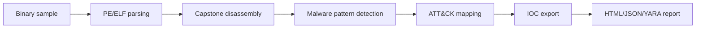

# AIDebug

[](https://pypi.org/project/1200km-aidebug/)
[](https://pypi.org/project/1200km-aidebug/)
[](https://github.com/anpa1200/AIDebug/actions/workflows/ci.yml)
[](https://github.com/anpa1200/AIDebug/actions/workflows/publish.yml)
[](LICENSE)

AI-assisted malware reverse-engineering debugger that turns function behavior into ATT&CK mappings, YARA rules, IOC exports, and analyst reports.

## Demo

Add an 8-15 second GIF showing: sample load -> function analysis -> ATT&CK mapping -> report export.

## What This Is For

A malware analyst runs AIDebug when a sample needs fast triage before deeper reverse engineering. The goal is not magic attribution. The goal is structured behavior, technique mapping, and detection-ready output.

## What It Produces

| Output | Use |
|---|---|
| HTML report | Analyst review and case notes |
| JSON report | SIEM/SOAR/OpenCTI ingest |
| YARA rules | Detection engineering seed |
| IOC list | Pivoting and enrichment |
| CFG visualization | Function-level behavior review |
| ATT&CK mapping | Technique-level reporting |

## Quick Start

### PyPI install

```bash
pip install 1200km-aidebug
aidebug --help
```

The PyPI distribution is named `1200km-aidebug`; the installed command is
`aidebug`.

Dynamic Frida instrumentation is optional:

```bash
pip install "1200km-aidebug[dynamic]"
```

### From source

```bash
git clone https://github.com/anpa1200/AIDebug.git
cd AIDebug
python3 -m venv .venv
source .venv/bin/activate
pip install -e ".[dynamic]"
aidebug --binary samples/example.exe --no-tui --report --json-export --out-dir reports/
```

Set `ANTHROPIC_API_KEY` before AI-backed function analysis or YARA generation:

```bash
export ANTHROPIC_API_KEY=sk-ant-...
```

## How It Works



## How AIDebug Feeds Detection Engineering

AIDebug extracts function-level behavior, maps suspicious logic to ATT&CK technique IDs, emits YARA candidates, and exports IOC lists suitable for enrichment or OpenCTI ingest. Treat the output as analyst-reviewed detection seed material, not final truth.

## Coverage

| Area | Coverage |
|---|---|
| Malware patterns | XOR loops, stack strings, API hashing, RDTSC timing, direct syscalls, NOP sleds, null-safe XOR, Base64 tables |
| Formats | PE32, PE64, ELF |
| Architectures | x86, x86-64, ARM, AArch64, RISC-V |
| Dynamic mode | Frida, remote frida-server, INetSim sandbox support |
| Reports | HTML, JSON, YARA |

## Safety

Use AIDebug only in an isolated malware-analysis VM or lab. Do not run unknown
samples on your host OS. Static analysis can inspect PE/ELF files directly;
dynamic mode attaches Frida to a running process or sandbox and should be used
only with authorization and isolation.

## Limitations And Honesty

AIDebug accelerates triage. It does not replace manual reverse engineering, sandbox validation, or analyst judgment. ATT&CK mappings and YARA output must be reviewed before operational use.

## Companion Article

https://medium.com/@1200km/ai-powered-malware-debugger-that-explains-every-function-it-sees-2a28ef75df8a

## Citation

See `CITATION.cff`.

## License

[MIT](LICENSE).

## Security Policy

See `SECURITY.md`.
