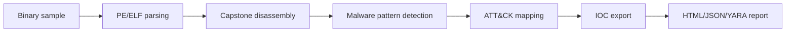

# AIDebug

AI-assisted malware reverse-engineering debugger that turns function behavior into ATT&CK mappings, YARA rules, IOC exports, and analyst reports.


## Demo

Add an 8-15 second GIF showing: sample load -> function analysis -> ATT&CK mapping -> report export.

## What This Is For

A malware analyst runs AIDebug when a sample needs fast triage before deeper reverse engineering. The goal is not magic attribution. The goal is structured behavior, technique mapping, and detection-ready output.

## What It Produces

| Output | Use |
|---|---|
| HTML report | Analyst review and case notes |
| JSON report | SIEM/SOAR/OpenCTI ingest |
| YARA rules | Detection engineering seed |
| IOC list | Pivoting and enrichment |
| CFG visualization | Function-level behavior review |
| ATT&CK mapping | Technique-level reporting |

## Quick Start

```bash
git clone https://github.com/anpa1200/AIDebug.git
cd AIDebug
python3 -m venv .venv
source .venv/bin/activate
pip install -r requirements.txt
python aidebug.py samples/example.exe --output reports/
```

## How It Works



## How AIDebug Feeds Detection Engineering

AIDebug extracts function-level behavior, maps suspicious logic to ATT&CK technique IDs, emits YARA candidates, and exports IOC lists suitable for enrichment or OpenCTI ingest. Treat the output as analyst-reviewed detection seed material, not final truth.

## Coverage

| Area | Coverage |
|---|---|
| Malware patterns | XOR loops, stack strings, API hashing, RDTSC timing, direct syscalls, NOP sleds, null-safe XOR, Base64 tables |
| Formats | PE32, PE64, ELF |
| Architectures | x86, x86-64, ARM, AArch64, RISC-V |
| Dynamic mode | Frida, remote frida-server, INetSim sandbox support |
| Reports | HTML, JSON, YARA |

## Limitations And Honesty

AIDebug accelerates triage. It does not replace manual reverse engineering, sandbox validation, or analyst judgment. ATT&CK mappings and YARA output must be reviewed before operational use.

## Companion Article

https://medium.com/@1200km/ai-powered-malware-debugger-that-explains-every-function-it-sees-2a28ef75df8a

## Citation

See `CITATION.cff`.

## License

MIT recommended.

## Security Policy

See `SECURITY.md`.
