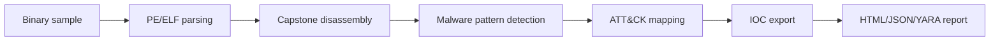

# AIDebug

[](https://pypi.org/project/1200km-aidebug/)
[](https://pypi.org/project/1200km-aidebug/)
[](https://github.com/anpa1200/AIDebug/actions/workflows/ci.yml)
[](https://github.com/anpa1200/AIDebug/actions/workflows/publish.yml)
[](LICENSE)
[](DISCOVERY.md)
[](DISCOVERY.md)
[](https://github.com/REMnux/salt-states/issues/345)
[](https://github.com/BlackArch/blackarch/issues/4965)

AI-assisted malware reverse-engineering debugger that turns function behavior into ATT&CK mappings, YARA rules, IOC exports, and analyst reports.

## Project Maturity Evidence

| Area | Evidence |
|---|---|
| Install and package | [PyPI package](https://pypi.org/project/1200km-aidebug/), [`pyproject.toml`](pyproject.toml), Debian/Kali files in [`debian/`](debian/) |
| Usage documentation | [Quick start](#quick-start), [analyst workflow](docs/analyst-workflow.md), [safe examples](examples/README.md) |
| Safety and scope | [Safety model](docs/safety-model.md), [security policy](SECURITY.md), [limitations](#limitations-and-honesty) |
| Quality checks | [CI workflow](.github/workflows/ci.yml), unit tests in [`tests/`](tests/), package build job |
| Reviewer evidence | [sample evidence index](docs/sample-evidence.md), screenshots in [`assets/screenshots/`](assets/screenshots/), mock outputs in [`examples/mock-output/`](examples/mock-output/) |
| Validation | [validation plan](docs/validation-plan.md), deterministic tests for pattern detection and JSON export |
| Maintenance | [maintainers](MAINTAINERS.md), [roadmap](ROADMAP.md), [changelog](CHANGELOG.md), [contributing](CONTRIBUTING.md) |
| Positioning | [comparison](docs/comparison.md), [curated-list resubmission plan](docs/curated-list-resubmission-plan.md) |

Curated-list resubmission should wait for additional release history and public
usage evidence. This repository now documents the quality bar, but age and
adoption still require time.

## Screenshots

Screenshots are taken from the companion walkthrough article:
[AI-Powered Malware Debugger That Explains Every Function It Sees](https://medium.com/bugbountywriteup/ai-powered-malware-debugger-that-explains-every-function-it-sees-2a28ef75df8a).


| Behavioral patterns | Control flow graph |
|---|---|
|  |  |

| Pattern detection output | Four-panel TUI |
|---|---|
|  |  |

## What This Is For

A malware analyst runs AIDebug when a sample needs fast triage before deeper reverse engineering. The goal is not magic attribution. The goal is structured behavior, technique mapping, and detection-ready output.

## What It Produces

| Output | Use |
|---|---|
| HTML report | Analyst review and case notes |
| JSON report | SIEM/SOAR/OpenCTI ingest |
| YARA rules | Detection engineering seed |
| IOC list | Pivoting and enrichment |
| CFG visualization | Function-level behavior review |
| ATT&CK mapping | Technique-level reporting |

## Quick Start

### PyPI install

```bash
pip install 1200km-aidebug
aidebug --help
```

The PyPI distribution is named `1200km-aidebug`; the installed command is
`aidebug`.

Dynamic Frida instrumentation is optional:

```bash
pip install "1200km-aidebug[dynamic]"
```

### From source

```bash
git clone https://github.com/anpa1200/AIDebug.git
cd AIDebug
python3 -m venv .venv
source .venv/bin/activate
pip install -e ".[dynamic]"
aidebug --binary samples/example.exe --no-tui --report --json-export --out-dir reports/
```

Set `ANTHROPIC_API_KEY` before AI-backed function analysis or YARA generation:

```bash
export ANTHROPIC_API_KEY=sk-ant-...
```

## Safe Examples

The [`examples/`](examples/) directory contains safe, non-malicious demo
material:

- [`examples/toy_xor_config.py`](examples/toy_xor_config.py) - a benign toy XOR
  loop for documentation.
- [`examples/mock-output/aidebug-session.json`](examples/mock-output/aidebug-session.json)
  - representative JSON export.
- [`examples/mock-output/aidebug-candidate.yar`](examples/mock-output/aidebug-candidate.yar)
  - representative analyst-review YARA seed.
- [`examples/mock-output/aidebug-report.html`](examples/mock-output/aidebug-report.html)
  - compact mock HTML report.

These examples are not live malware and are intended for README previews,
parser tests, and integration demos.

## How It Works



## How AIDebug Feeds Detection Engineering

AIDebug extracts function-level behavior, maps suspicious logic to ATT&CK technique IDs, emits YARA candidates, and exports IOC lists suitable for enrichment or OpenCTI ingest. Treat the output as analyst-reviewed detection seed material, not final truth.

## Coverage

| Area | Coverage |
|---|---|
| Malware patterns | XOR loops, stack strings, API hashing, RDTSC timing, direct syscalls, NOP sleds, null-safe XOR, Base64 tables |
| Formats | PE32, PE64, ELF |
| Architectures | x86, x86-64, ARM, AArch64, RISC-V |
| Dynamic mode | Frida, remote frida-server, INetSim sandbox support |
| Reports | HTML, JSON, YARA |

## Safety

Use AIDebug only in an isolated malware-analysis VM or lab. Do not run unknown
samples on your host OS. Static analysis can inspect PE/ELF files directly;
dynamic mode attaches Frida to a running process or sandbox and should be used
only with authorization and isolation.

## Limitations And Honesty

AIDebug accelerates triage. It does not replace manual reverse engineering, sandbox validation, or analyst judgment. ATT&CK mappings and YARA output must be reviewed before operational use.

## Companion Article

https://medium.com/bugbountywriteup/ai-powered-malware-debugger-that-explains-every-function-it-sees-2a28ef75df8a

## Community

- Use GitHub Issues for reproducible bugs and feature requests.
- Use GitHub Discussions for workflow questions, integration ideas, and analyst
  usage patterns.
- Do not upload live malware samples to issues or discussions.

## Discovery And Launch Material

Use [`DISCOVERY.md`](DISCOVERY.md) for canonical links, platform-specific launch
copy, newsletter pitch text, and current external submission tracking.

## Citation

See `CITATION.cff`.

## License

[MIT](LICENSE).

## Security Policy

See `SECURITY.md`.

## 1200km Ecosystem

This project is part of the 1200km security research ecosystem. Use [AdversaryGraph](https://1200km.com/adversarygraph/) for CTI-to-detection workflows, ATT&CK/ATLAS mapping, actor relevance, IOC enrichment, and analyst-ready reporting.

- [AdversaryGraph project hub](https://1200km.com/adversarygraph/)
- [AdversaryGraph documentation](https://1200km.com/adversarygraph-docs/)
- [Live ATT&CK/ATLAS workspace](https://1200km.com/threat-matrix/)
- [1200km security research ecosystem](https://1200km.com/)

