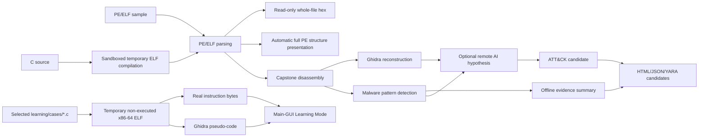

# AIDebug

[](https://pypi.org/project/1200km-aidebug/)
[](https://pypi.org/project/1200km-aidebug/)
[](https://github.com/anpa1200/AIDebug/actions/workflows/ci.yml)
[](https://github.com/anpa1200/AIDebug/actions/workflows/publish.yml)
[](LICENSE)
[](DISCOVERY.md)
[](https://github.com/InQuest/awesome-yara/pull/78)
[](https://github.com/REMnux/salt-states/issues/345)
[](https://github.com/BlackArch/blackarch/issues/4965)

Malware reverse-engineering CLI/TUI with deterministic offline triage, Ghidra
reconstruction, optional LLM cross-checks, active local ELF debugging, guided
assembly learning in the main full-screen GUI, ATT&CK candidates, YARA seeds,
and analyst reports.

> **Current release:** [AIDebug v2.0.0](https://github.com/anpa1200/AIDebug/releases/tag/v2.0.0).
> Its [PyPI distributions](https://pypi.org/project/1200km-aidebug/2.0.0/)
> were built from the immutable version-matched tag by the verified publishing
> workflow.

## Project Maturity Evidence

| Area | Evidence |
|---|---|
| Install and package | [PyPI package](https://pypi.org/project/1200km-aidebug/), [`pyproject.toml`](pyproject.toml), Debian/Kali files in [`debian/`](debian/) |
| Usage documentation | [Quick start](#quick-start), [Learning Mode](#learning-mode), [analyst workflow](docs/analyst-workflow.md), [safe examples](examples/README.md) |
| Safety and scope | [Safety model](docs/safety-model.md), [security policy](SECURITY.md), [limitations](#limitations-and-honesty) |
| Quality checks | [CI workflow](.github/workflows/ci.yml), unit tests in [`tests/`](tests/), package build job |
| Reviewer evidence | [sample evidence index](docs/sample-evidence.md), screenshots in [`assets/screenshots/`](assets/screenshots/), mock outputs in [`examples/mock-output/`](examples/mock-output/) |
| Validation | [validation plan](docs/validation-plan.md), deterministic tests for pattern detection and JSON export |
| Maintenance | [maintainers](MAINTAINERS.md), [roadmap](ROADMAP.md), [changelog](CHANGELOG.md), [contributing](CONTRIBUTING.md) |
| Positioning | [comparison](docs/comparison.md), [curated-list resubmission plan](docs/curated-list-resubmission-plan.md) |
| Release gate | [release readiness](docs/release-readiness.md), [`scripts/release-readiness.sh`](scripts/release-readiness.sh) |

Curated-list resubmission should wait for additional release history and public
usage evidence. This repository now documents the quality bar, but age and
adoption still require time.

## Screenshots

These are illustrative captures associated with the companion walkthrough
article; they are not automated accuracy evidence. See the
[capture provenance and checksums](assets/screenshots/README.md).


| Behavioral patterns | Control flow graph |
|---|---|
|  |  |

| Pattern detection output | Four-panel TUI |
|---|---|
|  |  |

## What This Is For

A malware analyst runs AIDebug when a sample needs fast triage before deeper reverse engineering. The goal is not magic attribution. The goal is structured behavior, technique hypotheses, and review-ready seed material.

## What It Produces

| Output | Use |
|---|---|
| HTML report | Analyst review and case notes |
| Versioned JSON report | Custom SIEM/SOAR adapter input; no vendor-native or STIX schema is claimed |
| YARA candidate rules | Detection-engineering seed that must be compiled and tested |
| Heuristic IOC strings in JSON | Analyst-reviewed pivot candidates, not a standalone IOC feed |
| CFG visualization | Function-level behavior review |
| Hex / PE workspace | Read-only whole-file hex for every loaded binary; PE files additionally show DOS/NT/optional headers, sections, directories, imports, exports, forwarders, and overlays |
| Ghidra C-like decompilation | Native-code reconstruction for function triage; not recovered original source |
| Full reconstruction file | One provenance-marked C-like file for every discovered function |
| LLM decompilation cross-check | Assembly-grounded consistency/uncertainty review for AI-analyzed functions |
| Active ELF debugger | GDB breakpoints, stepping, registers/deltas, and function I/O candidates |
| Live Learning Mode | Main-GUI exploration of 100 standalone C cases or a validated external collection, with real compiler output, AIDebug disassembly, and Ghidra reconstruction |
| Hash-indexed analysis history | Local recovery of prior sessions and compatible AI findings when the same SHA-256 is opened again |
| Remote-AI ATT&CK candidate | Technique-level hypothesis for analyst validation |

## Quick Start

### Current source checkout

```bash
git clone https://github.com/anpa1200/AIDebug.git
cd AIDebug
python3 -m venv .venv
source .venv/bin/activate
pip install -e .
aidebug --help
aidebug --version
aidebug --binary /path/to/sample --offline --no-tui --json-export --out-dir reports/
```

ELF binaries use the same static-analysis command as PE files:

```bash
aidebug --binary /path/to/sample.elf --offline --no-tui
```

### Hex viewer and PE Structure workspace

Open a supported binary in the main GUI, then press `X`:

```bash
aidebug --binary /path/to/sample.exe --offline
aidebug --binary /path/to/sample.elf --offline
```

Every loaded binary receives a whole-file Hex view plus file metadata. When the
file is PE32 or PE32+, AIDebug automatically opens the richer PE workspace with
Overview, Hex, Headers, Sections, Directories, Imports, and Exports tabs. The
header view includes the DOS header, NT signature, COFF file header, and
optional header. The raw COFF `Characteristics` bitmask is preserved and each
set flag is decoded by name, including executable, DLL, system, relocation,
32-bit-machine, and large-address-aware flags. Optional-header
`DllCharacteristics` flags are also decoded, with cautious mitigation clues for
ASLR, high-entropy VA, DEP/NX, CFG, integrity checks, AppContainer, and SEH.
Imports include normal and delay-loaded entries; exports include ordinals and
forwarders. Overlay offset and size are reported when extra data follows the
mapped image. `P` remains an additional shortcut for analysts accustomed to
opening PE Structure directly.

The Hex tab covers every byte of the exact file content AIDebug hashed. It uses
4 KiB pages instead of creating one unbounded terminal document: use
`PageUp`/`PageDown` to move, and `Home`/`End` to jump to the first or last page.
Imports and exports are likewise paged for responsive navigation. Press
`Escape` to return to function analysis. This workspace is offline and
read-only: it does not execute the PE or reopen its source path.

Add bounded Ghidra decompiler output to the CLI, TUI, HTML, and JSON with
`--decompile`. Install Ghidra first, or provide its headless launcher explicitly:

```bash
aidebug --binary /path/to/sample.elf --offline --no-tui --decompile
aidebug --binary /path/to/sample.exe --offline --no-tui --decompile \
  --ghidra-headless /opt/ghidra/support/analyzeHeadless
```

Reconstruct every discovered function into one file:

```bash
aidebug --binary /path/to/sample.elf --offline --no-tui \
  --decompile-all case/sample-full.c
```

The destination must not already exist. The combined file is created with
owner-only permissions and begins with input hash, architecture, backend, and
non-original-source warnings. Discovery remains bounded to 300 functions; “all”
means every function AIDebug discovered within that explicit safety ceiling.

AIDebug discovers `analyzeHeadless` from `PATH`, common installation locations,
or `AIDEBUG_GHIDRA_HEADLESS`. It runs one isolated temporary Ghidra project and
uses Ghidra's native-code decompiler. The C-like result is reconstructed output,
not original source: inferred types, names, expressions, and structure still
require analyst review. AIDebug fails clearly when Ghidra is unavailable; it
does not substitute register-to-text heuristics and call that decompilation.

When remote AI is enabled and a function has Ghidra output, the same bounded AI
request compares that reconstruction with the supplied disassembly, calls,
strings, patterns, and optional runtime state. The result is labelled
`CONSISTENT`, `PARTIAL`, or `CONTRADICTED` with confidence and evidence. This is
an LLM cross-check, not proof of source correctness. Offline mode reports that
the available reconstruction was not remotely cross-checked.

### Active local ELF debugging

GDB-backed active mode executes the selected program. Use it only inside an
isolated analysis VM:

```bash
aidebug --binary ./sample.elf --mode debug --breakpoint main
```

Available commands are `break LOCATION`, `continue`, `step`, `next`, `finish`,
`registers`, `changes`, `io`, `disassemble`, and `quit`. `step` and `next` operate
at instruction granularity. `io` reports calling-convention register candidates
and a GDB return value or explicitly labelled ABI return-register candidate.
Use repeatable `--debug-arg` values for target arguments and repeatable
`--debug-command` values for non-interactive lab automation. Active mode
currently supports local ELF targets; use Frida dynamic mode for remote or
Windows targets. GDB is a system dependency rather than a Python package.

### Learning mode

Learning Mode is integrated into AIDebug's original full-screen GUI. It is not
a simulated instruction viewer: every lesson is backed by a standalone C file,
a real temporary x86-64 ELF build, complete symbol disassembly, and Ghidra
pseudo-code recovered from that build.

Learning Mode runs locally, does not open the session database, never sends
content to an AI provider, and never executes the compiled lesson artifact.

#### Launch the GUI

Open the complete 100-case catalog:

```bash
aidebug --learn
```

Open the full catalog and immediately analyze a specific case:

```bash
aidebug --learn mov-load
aidebug --learn lea-arithmetic
aidebug --learn movsxd
aidebug --learn xchg
aidebug --learn subtract
aidebug --learn binary-search
```

Search by title, category, instruction, or concept to open a filtered catalog:

```bash
aidebug --learn "data movement"
aidebug --learn "loops and arrays"
```

An exact lesson ID keeps the entire catalog available and preselects that case.
A broader search opens only matching cases.

#### Main GUI layout

| GUI area | Evidence shown |
|---|---|
| Learning Cases | Search result or all 100 standalone cases, with ID, category, and lesson title |
| Real Disassembly | Actual function address, instruction bytes, and compiler-generated assembly |
| Original C Source | Exact contents and repository path of the selected lesson file |
| Pseudo-code tab | Ghidra's independent C-like reconstruction from the generated ELF |
| Lesson tab | Meaning, register/flag effects, analyst clue, and common misreading |
| Build Evidence tab | Function, ELF address, compiler identity, artifact SHA-256, and execution-safety statement |
| Help tab | The live learning workflow and interpretation caveats |

#### Controls

| Key | Action |
|---|---|
| Arrow keys | Navigate the focused case table or scroll the focused evidence pane |
| Enter | Compile and analyze the selected case |
| Tab / Shift+Tab | Move focus between GUI controls |
| R | Recompile and reanalyze the current case |
| Q | Quit Learning Mode |

Analyzed results are cached only for the current GUI session. Returning to a
case reloads its cached result; press `R` when you want fresh compiler and
Ghidra output.

#### External collections

Open a directory of standalone external C lessons in the same GUI:

```bash
aidebug --learn --learning-collection /path/to/my-cases
aidebug --learn external-add --learning-collection /path/to/my-cases
```

The directory must contain `case_common.h` and one or more `.c` files. Each
file ID such as `external-add.c` must define a matching public function such as
`learn_external_add(...)`. An optional `collection.json` controls ordering and
lesson metadata; [`learning/cases/`](learning/cases/) is a complete 100-case
reference collection that can also be loaded externally:

```bash
aidebug --learn --learning-collection ./learning/cases
```

AIDebug rejects absolute or escaping manifest paths, duplicate/invalid IDs,
oversized files, non-UTF-8 input, and missing expected symbols. The generated
ELF is never executed, but the local compiler still parses the supplied source;
review external collections before loading them.

#### Evidence pipeline and safety

Every lesson is a separate file under [`learning/cases/`](learning/cases/).
When a case is selected, AIDebug:

1. copies only that bundled C file and `case_common.h` to a temporary directory;
2. compiles it into an x86-64 ELF shared object without running it;
3. resolves the lesson's real symbol and size;
4. decodes the complete compiler-generated function, including addresses and
   instruction bytes;
5. asks the same Ghidra backend used by normal analysis to reconstruct
   pseudo-code from the machine code; and
6. removes the temporary build directory when analysis finishes.

The panes show the exact source-file path and contents, compiler identity,
artifact SHA-256, symbol address, real assembly, Ghidra output, and the
non-original-source warning. There is no handwritten pseudo-code fallback.
Compiler versions and optimization behavior may produce different valid
instruction sequences, so always compare pseudo-code with the displayed source
and assembly.

#### Text-only mode

For terminal output, scripts, or CI, add `--no-tui`:

```bash
aidebug --learn --no-tui
aidebug --learn movsxd --no-tui
```

Without a topic, text mode prints the catalog. An exact lesson ID compiles and
analyzes that one case. A broader query prints matching catalog entries.

#### Requirements and toolchain overrides

Live cases require:

- an x86-64 ELF-capable `cc`, `gcc`, or `clang`;
- Ghidra's `analyzeHeadless`; and
- a terminal supported by Textual for the full-screen interface.

Override compiler or Ghidra discovery when necessary:

```bash
aidebug --learn switch-dispatch \
  --learning-compiler /usr/bin/gcc \
  --ghidra-headless /opt/ghidra/support/analyzeHeadless
```

C source analysis requires an ELF-capable `cc`, `gcc`, or `clang` plus
Bubblewrap (`bwrap`). AIDebug copies the selected translation unit into a
filesystem-isolated build directory, compiles a temporary ELF shared object,
analyzes it, and deletes it without execution:

```bash
aidebug --source /path/to/sample.c --offline --no-tui
```

On Ubuntu 24.04, AppArmor may block Bubblewrap with `setting up uid map:
Permission denied` when the system lacks a Bubblewrap user-namespace profile.
Install and load the upstream `bwrap-userns-restrict` AppArmor profile rather
than disabling `kernel.apparmor_restrict_unprivileged_userns` globally. See the
[Ubuntu 24.04 user-namespace guidance](https://documentation.ubuntu.com/release-notes/24.04/#unprivileged-user-namespace-restrictions).

The C workflow accepts one `.c` translation unit up to 2 MiB. System headers
are available, but project-local headers and multi-file builds are not yet
supported. Dynamic mode and YARA generation are deliberately unavailable for
source inputs because their evidence comes from a temporary compiled surrogate.

The base source installation supports deterministic offline analysis. After the
next release, the PyPI distribution remains `1200km-aidebug` and the command is
`aidebug`.

Remote AI analysis is an optional extra:

```bash
pip install -e ".[ai]"
export ANTHROPIC_API_KEY=sk-ant-...
aidebug --binary /path/to/sample
```

The `ai` extra includes both the Anthropic SDK and `yara-python`: remote YARA
candidates are accepted only after local compilation and broad-rule probes.

Bulk CLI/report analysis with the remote provider also requires the explicit
`--accept-ai-cost` acknowledgement. Review the [remote data
boundary](docs/safety-model.md#remote-ai-data-boundary) first.

Dynamic Frida instrumentation is optional:

```bash
pip install -e ".[dynamic]"
```

Install both optional capabilities from the checkout with `pip install -e
".[all]"`.

### Session storage

The default SQLite database is
`$XDG_STATE_HOME/aidebug/traces.db` (normally
`~/.local/state/aidebug/traces.db`) on Linux and below `%LOCALAPPDATA%` on
Windows. Override it per case with `--db /controlled/path/session.db` or
`AIDEBUG_DB_PATH`. Existing repository-local `traces.db` files are not migrated
automatically.

Every analysis session records the sample SHA-256, mode, analyzer, lifecycle
status, function findings, decompilation, deterministic patterns, and bounded
runtime evidence. When the same bytes are opened again—even from a different
filename or path—AIDebug finds prior sessions by SHA-256. The main GUI adds a
`History` tab, and compatible stored function analyses are restored without a
second remote-AI request. Separate sessions are retained so a later run never
silently overwrites earlier evidence.

Query the database with either the sample file or its full SHA-256:

```bash
aidebug --history /path/to/sample.exe
aidebug --history 0123456789abcdef0123456789abcdef0123456789abcdef0123456789abcdef
```

The history view lists previous session metadata, evidence counts, risk counts,
and stored AI function summaries. Use the displayed session ID to export every
persisted field:

```bash
aidebug --session 7 --json-export --out-dir reports/
```

In the main GUI, press `Ctrl+H` to open hash-matched history. The database and
exports can contain sensitive sample evidence; protect them as case data.

### Source checkout with all optional capabilities

```bash
git clone https://github.com/anpa1200/AIDebug.git
cd AIDebug
python3 -m venv .venv
source .venv/bin/activate
pip install -e ".[all]"
aidebug --binary /path/to/sample --offline --no-tui --report --json-export --out-dir reports/
```

## Safe Examples

The [`examples/`](examples/) directory contains safe, non-malicious demo
material:

- [`examples/toy_xor_config.py`](examples/toy_xor_config.py) - a benign toy XOR
  loop for documentation.
- [`examples/toy_c_analysis.c`](examples/toy_c_analysis.c) - a benign C fixture
  for sandboxed temporary-ELF analysis.
- [`learning/cases/`](learning/cases/) - 100 benign, standalone C functions used
  by the real Learning Mode compile/disassemble/decompile pipeline.
- [`examples/mock-output/aidebug-session.json`](examples/mock-output/aidebug-session.json)
  - hand-authored schema-v2 offline session example with an all-zero mock hash.
- [`examples/mock-output/aidebug-candidate.yar`](examples/mock-output/aidebug-candidate.yar)
  - illustrative analyst-review YARA seed.
- [`examples/mock-output/aidebug-report.html`](examples/mock-output/aidebug-report.html)
  - compact illustrative HTML fragment, not a full current generated report.

These examples are not live malware and are intended for documentation, parser
tests, and integration demos. They are not execution or accuracy evidence.

## How It Works


```mermaid
flowchart LR
  Sample[PE/ELF sample] --> Parse[PE/ELF parsing]
  Parse --> HexView[Read-only whole-file hex]
  Parse --> PEView[Automatic full PE structure presentation]
  Source[C source] --> Compile[Sandboxed temporary ELF compilation]
  Compile --> Parse
  Lesson[Selected learning/cases/*.c] --> LearnCompile[Temporary non-executed x86-64 ELF]
  LearnCompile --> LearnDisasm[Real instruction bytes]
  LearnCompile --> LearnGhidra[Ghidra pseudo-code]
  LearnDisasm --> LearnGUI[Main-GUI Learning Mode]
  LearnGhidra --> LearnGUI
  Parse --> Disasm[Capstone disassembly]
  Disasm --> Ghidra[Ghidra reconstruction]
  Disasm --> Patterns[Malware pattern detection]
  Patterns --> Offline[Offline evidence summary]
  Patterns --> Remote[Optional remote AI hypothesis]
  Ghidra --> Remote
  Remote --> Attack[ATT&CK candidate]
  Offline --> Report[HTML/JSON/YARA candidates]
  Attack --> Report
```

## How AIDebug Feeds Detection Engineering

AIDebug records function-level evidence, produces deterministic pattern summaries
offline, and can ask a remote model for explanations and ATT&CK candidates. JSON
contains heuristic strings from higher-risk functions for analyst review. It is
not STIX, an OpenCTI connector, a vendor-native SIEM integration, or final truth.

## Coverage

| Area | Coverage |
|---|---|
| Malware patterns | XOR loops, stack strings, API hashing, RDTSC timing, direct syscalls, NOP sleds, null-safe XOR, Base64 tables |
| Formats | PE32, PE64, ELF, and one-file C source compiled to a temporary ELF |
| File inspection | Main-GUI whole-file hex for loaded binaries; PE files add DOS/NT/optional headers, sections, data directories, imports/delay imports, exports/forwarders, and overlays |
| Architectures | Parser/disassembler paths for x86, x86-64, ARM, AArch64, and RISC-V; coverage varies by format and fixture |
| Dynamic mode | Optional local/remote Frida hooks with readiness/error reporting; operator-managed sandbox/network controls |
| Active debug | Local ELF execution through GDB/MI with analyst-controlled breakpoints and instruction stepping |
| Learning | 100 bundled or externally loaded x86-64 source cases in the main GUI, with exact C, real assembly, build evidence, and Ghidra output |
| Reports | HTML, versioned AIDebug JSON, and YARA candidates |

## Safety

Use AIDebug only in an isolated malware-analysis VM or lab. Do not run unknown
samples on your host OS. Static analysis can inspect PE/ELF files directly.
C inputs are compiled inside a Bubblewrap filesystem sandbox and the generated
ELF is never executed. Dynamic mode attaches Frida to a running process or
sandbox; active debug mode launches a local ELF through GDB. Both dynamic paths
should be used only with authorization and isolation.

## Limitations And Honesty

AIDebug accelerates triage. It does not replace manual reverse engineering,
sandbox validation, or analyst judgment. Discovery is bounded and can miss
indirect, packed, overlaid, stripped, or unreachable code. Heuristic library
identification can collide. ATT&CK, risk, IOC, and YARA outputs require review.
Dynamic static-to-runtime address mapping can be incomplete under ASLR/PIE.
The optional Ghidra integration produces bounded C-like reconstruction from
machine code. It is compiler-grade decompiler output, but it is still not
recovered original source and must be checked against disassembly and behavior.
An LLM cross-check can identify inconsistencies in the bounded evidence it
receives, but it cannot prove semantic equivalence or repair missing discovery
coverage.
Tracer startup reports whether each observer is ready and how many hooks are
installed at that moment; a zero count can increase when a watched module loads
later and is not evidence that any target call was captured.

Session databases and exports can contain sensitive sample and runtime evidence
and are not encrypted by AIDebug. See the [safety and privacy
model](docs/safety-model.md).

Current protective defaults reject binary samples above 128 MiB and C source
above 2 MiB, cap C compilation at 30 seconds, cap discovery at 300
functions and 250 instructions per function, scan at most 100,000 symbols, cap
stored import/export candidates at 50,000 each, cap dynamic instrumentation at 50
function hooks, cap one YARA ruleset at the requested `--max-functions` value,
and cap persisted API, network, and runtime records at 10,000 per category per
session. These are resource guards, not coverage or retention guarantees.
Generated filenames include the session ID so separate analyses of identically
named samples do not silently overwrite one another in the same output folder.

## Companion Article

https://medium.com/bugbountywriteup/ai-powered-malware-debugger-that-explains-every-function-it-sees-2a28ef75df8a

## Community

- Use GitHub Issues for reproducible bugs and feature requests.
- Use GitHub Discussions for workflow questions, integration ideas, and analyst
  usage patterns.
- Do not upload live malware samples to issues or discussions.

## Discovery And Launch Material

Use [`DISCOVERY.md`](DISCOVERY.md) for canonical links, platform-specific launch
copy, newsletter pitch text, and current external submission tracking.

## Citation

See `CITATION.cff`.

## License

[MIT](LICENSE).

## Security Policy

See `SECURITY.md`.

## 1200km Ecosystem

This project is part of the 1200km security research ecosystem. Use [AdversaryGraph](https://1200km.com/adversarygraph/) for CTI-to-detection workflows, ATT&CK/ATLAS mapping, actor relevance, IOC enrichment, and analyst-ready reporting.

- [AdversaryGraph project hub](https://1200km.com/adversarygraph/)
- [AdversaryGraph documentation](https://1200km.com/adversarygraph-docs/)
- [Live ATT&CK/ATLAS workspace](https://1200km.com/threat-matrix/)
- [1200km security research ecosystem](https://1200km.com/)
