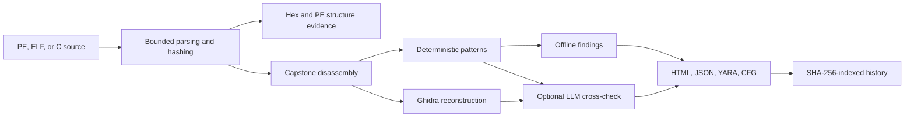

# AIDebug

[](https://pypi.org/project/1200km-aidebug/3.0.0/)
[](https://pypi.org/project/1200km-aidebug/3.0.0/)
[](https://github.com/anpa1200/AIDebug/actions/workflows/ci.yml)
[](https://github.com/anpa1200/AIDebug/actions/workflows/publish.yml)
[](LICENSE)
[](https://github.com/anpa1200/AIDebug/releases/latest)

AIDebug is an evidence-focused malware reverse-engineering CLI and terminal UI.
It combines deterministic offline triage, whole-file hex inspection, deep PE
structure analysis, Capstone disassembly, Ghidra reconstruction, optional LLM
cross-checks, local ELF debugging, compiled learning exercises, and
analyst-review reporting.

> Current release: [AIDebug v3.0.0](https://github.com/anpa1200/AIDebug/releases/tag/v3.0.0),
> published as [`1200km-aidebug`](https://pypi.org/project/1200km-aidebug/3.0.0/).

## Highlights

- Deterministic PE and ELF static triage without requiring an AI service.
- Read-only, paged hex viewer for the complete analyzed file.
- Deep PE32/PE32+ structure explorer with mapped RVA, VA, and file offsets.
- Ghidra-backed C-like reconstruction for one function or the complete bounded
  function set.
- Optional evidence-grounded review through Anthropic, OpenAI, Google Gemini,
  or a local Ollama-compatible endpoint.
- GDB-backed local ELF debugging with breakpoints, stepping, registers, deltas,
  disassembly context, and function input/output candidates.
- One hundred standalone C learning cases with real compiler output,
  disassembly, and Ghidra pseudo-code in the main GUI.
- SHA-256-indexed local analysis history and compatible finding restoration.
- HTML, versioned JSON, YARA-candidate, ATT&CK-candidate, and CFG outputs for
  analyst review.

## Installation

Install the stable package from PyPI:

```bash
python3 -m venv .venv
source .venv/bin/activate
python -m pip install --upgrade pip
python -m pip install 1200km-aidebug==3.0.0
aidebug --version
```

Install optional capabilities as needed:

```bash
# Remote/local LLM providers and validated YARA generation
python -m pip install "1200km-aidebug[ai]==3.0.0"

# Frida dynamic instrumentation
python -m pip install "1200km-aidebug[dynamic]==3.0.0"

# All optional Python integrations
python -m pip install "1200km-aidebug[all]==3.0.0"
```

For development:

```bash
git clone https://github.com/anpa1200/AIDebug.git
cd AIDebug
python3 -m venv .venv
source .venv/bin/activate
python -m pip install -e ".[dev,dynamic]"
```

Ghidra, GDB, Bubblewrap, a C compiler, and Frida target components are external
tools used only by the workflows that require them.

## Quick Start

Open a PE or ELF sample in the main terminal interface:

```bash
aidebug --binary /path/to/sample.exe --offline
```

Run deterministic analysis without the full-screen UI and export evidence:

```bash
aidebug --binary /path/to/sample.exe \
  --offline --no-tui --report --json-export --yara \
  --out-dir reports/
```

Use Ghidra reconstruction:

```bash
aidebug --binary /path/to/sample.exe --offline --no-tui --decompile
aidebug --binary /path/to/sample.exe --offline --no-tui \
  --decompile-all reports/sample-reconstruction.c
```

Analyze one C translation unit through a temporary, non-executed ELF artifact:

```bash
aidebug --source /path/to/example.c --offline --no-tui
```

Inspect prior analysis by file or SHA-256:

```bash
aidebug --history /path/to/sample.exe
aidebug --history 0123456789abcdef0123456789abcdef0123456789abcdef0123456789abcdef
```

## PE Structure Workspace

Load a PE file and press `X` (or `P`) in the main GUI. AIDebug presents the
exact bytes it hashed and organizes structural evidence into bounded,
navigable views.

| Area | Evidence |
|---|---|
| Headers | DOS, NT, COFF, Optional Header, characteristics, data directories, and mitigation flags |
| Sections | Complete `IMAGE_SECTION_HEADER` fields, mapped ranges, entropy, and permissions |
| Imports and exports | Import descriptors, INT/IAT entries, delay imports, ordinals, names, RVAs, and forwarders |
| Resources | Type/name/language hierarchy, metadata, hashes, previews, and safe no-overwrite export |
| Relocations and ASLR | Relocation blocks/entries and structural ASLR compatibility assessment |
| TLS | TLS directory, template data, index, callback table, mappings, and termination evidence |
| Exceptions and unwind | x64 runtime functions, `UNWIND_INFO`, operations, handlers, and chained records |
| Load configuration | Versioned fields, Guard flags, stack-cookie and exploit-mitigation evidence |
| CFG | Check/dispatch pointers, Guard Function ID targets, ordering, suppression, and consistency checks |
| Authenticode | Certificate records, PKCS#7/X.509 evidence, PE image digest comparison, and signer verification |
| Debug and provenance | Rich header, Debug Directory, CodeView RSDS/NB10, PDB GUID, age, and path |
| Overlays | Exact offset, size, hash, entropy, preview, and safe export |
| .NET / CLR | COR20 header, metadata root and streams, ECMA-335 tables, assemblies, references, and resources |

AIDebug does not execute a PE while building these views. Static certificate
verification is not Windows root trust or revocation validation, Rich metadata
is not attribution, strong-name metadata is not publisher trust, and static
mitigation flags are not proof of effective runtime policy.

## Published Guides

These articles provide the long-form workflows and screenshots that complement
the repository documentation:

- [PE File Structure for Malware Analysis: A Practical Guide](https://1200km.com/articles/read/2026/2026-08-10-pe-file-structure-for-malware-analysis-d93acb97d9f3/) — PE layout, loader behavior, headers, sections, imports, exports, resources, relocations, TLS, mitigations, signatures, overlays, and .NET metadata with AIDebug.
- [Assembly for Malware Analysis: A Practical x86/x64 Guide](https://1200km.com/articles/read/2026/2026-08-09-assembly-for-malware-analysis-be0679241940/) — registers, flags, calling conventions, control flow, Windows APIs, and hands-on AIDebug learning cases.
- [AI-Powered Malware Debugger That Explains Every Function It Sees](https://medium.com/bugbountywriteup/ai-powered-malware-debugger-that-explains-every-function-it-sees-2a28ef75df8a) — the original AIDebug project walkthrough.

## Learning Mode

Open the complete catalog or start with a specific case:

```bash
aidebug --learn
aidebug --learn mov-load
aidebug --learn lea-arithmetic
aidebug --learn switch-dispatch
```

Each bundled case is a standalone file under [`learning/cases/`](learning/cases/).
AIDebug compiles the selected case into a temporary x86-64 ELF, shows the exact
C source and compiler-generated instructions, asks Ghidra for an independent
reconstruction, records build provenance, and removes the temporary artifact.
The generated lesson binary is never executed.

Use `--no-tui` for text output, or load a reviewed external collection:

```bash
aidebug --learn movsxd --no-tui
aidebug --learn --learning-collection /path/to/reviewed-cases
```

## AI Providers

AI analysis is optional. Deterministic offline mode remains available without
credentials.

```bash
python -m pip install "1200km-aidebug[ai]==3.0.0"
cp .env.example .env
chmod 600 .env
```

Configure exactly one provider, or set `AIDEBUG_LLM_PROVIDER` explicitly when
several credentials exist:

```dotenv
AIDEBUG_LLM_PROVIDER=anthropic
ANTHROPIC_API_KEY=replace_with_your_key

# Alternatives:
# OPENAI_API_KEY=replace_with_your_key
# GEMINI_API_KEY=replace_with_your_key
# OLLAMA_BASE_URL=http://127.0.0.1:11434/v1
```

Use `AIDEBUG_ENV_FILE=/absolute/path/to/private.env` to keep configuration away
from untrusted analysis directories. Remote bulk analysis requires the explicit
`--accept-ai-cost` acknowledgement. Review the [remote-AI data boundary](docs/safety-model.md#remote-ai-data-boundary)
before sending sample evidence to any provider.

## Active ELF Debugging

GDB-backed active mode executes the selected local ELF. Use it only inside an
isolated, authorized lab:

```bash
aidebug --binary ./sample.elf --mode debug --breakpoint main
```

Available commands include `break`, `continue`, `step`, `next`, `finish`,
`registers`, `changes`, `io`, `disassemble`, and `quit`. Frida dynamic mode is
available separately for supported local or remote instrumentation workflows.

## Outputs

| Output | Intended use |
|---|---|
| HTML report | Human review and case notes |
| Versioned JSON | Custom integration input; not a vendor-native or STIX schema |
| YARA candidates | Locally compiled detection-engineering seeds requiring review and testing |
| ATT&CK candidates | Technique-level hypotheses requiring analyst validation |
| CFG visualization | Function-level control-flow review |
| SQLite history | Local session evidence and SHA-256-based finding restoration |

## How It Works


```mermaid
flowchart LR
  Input[PE, ELF, or C source] --> Parse[Bounded parsing and hashing]
  Parse --> Structure[Hex and PE structure evidence]
  Parse --> Disasm[Capstone disassembly]
  Disasm --> Patterns[Deterministic patterns]
  Disasm --> Ghidra[Ghidra reconstruction]
  Patterns --> Offline[Offline findings]
  Patterns --> AI[Optional LLM cross-check]
  Ghidra --> AI
  Offline --> Reports[HTML, JSON, YARA, CFG]
  AI --> Reports
  Reports --> History[SHA-256-indexed history]
```

## Safety and Scope

Use AIDebug only on software and systems you are authorized to examine, inside
an isolated malware-analysis VM or lab.

- Static analysis does not execute the inspected PE or ELF.
- C inputs and learning cases are compiled to temporary artifacts that are not
  executed by their analysis workflows.
- GDB active mode launches a local ELF; Frida mode instruments a running target.
- Outputs are bounded evidence and hypotheses, not automatic attribution or
  final detection truth.
- Session databases and exports can contain sensitive evidence and are not
  encrypted by AIDebug.
- Ghidra output is reconstructed C-like code, not recovered original source.

Read the complete [safety model](docs/safety-model.md), [security policy](SECURITY.md),
and [limitations and validation plan](docs/validation-plan.md) before analyzing
untrusted samples.

## Documentation

| Document | Purpose |
|---|---|
| [Analyst workflow](docs/analyst-workflow.md) | Repeatable analysis process |
| [Safety model](docs/safety-model.md) | Trust boundaries and safe operation |
| [Validation plan](docs/validation-plan.md) | Testable capability claims |
| [Sample evidence](docs/sample-evidence.md) | Illustrative screenshots and mock artifacts |
| [Comparison](docs/comparison.md) | Scope and positioning |
| [Release readiness](docs/release-readiness.md) | Reproducible release gates |
| [AIDebug 3.0 release notes](docs/release-notes/v3.0.0.md) | Current release changes |
| [Changelog](CHANGELOG.md) | Version history |

## Development

Run the fast local checks:

```bash
python -m ruff check .
python -m pytest -q
```

Run the complete isolated release gate:

```bash
./scripts/release-readiness.sh
```

See [CONTRIBUTING.md](CONTRIBUTING.md) for contribution guidance. Do not attach
live malware, credentials, private case data, or unredacted evidence to issues
or pull requests.

## Project

- [Releases](https://github.com/anpa1200/AIDebug/releases)
- [PyPI](https://pypi.org/project/1200km-aidebug/)
- [Issues](https://github.com/anpa1200/AIDebug/issues)
- [Discussions](https://github.com/anpa1200/AIDebug/discussions)
- [Security policy](SECURITY.md)
- [Citation metadata](CITATION.cff)
- [1200km security research ecosystem](https://1200km.com/)

## License

AIDebug is released under the [MIT License](LICENSE).
