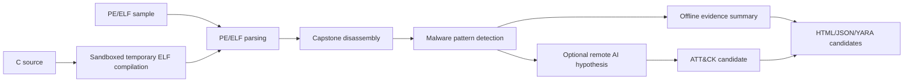

# AIDebug

[](https://pypi.org/project/1200km-aidebug/)
[](https://pypi.org/project/1200km-aidebug/)
[](https://github.com/anpa1200/AIDebug/actions/workflows/ci.yml)
[](https://github.com/anpa1200/AIDebug/actions/workflows/publish.yml)
[](LICENSE)
[](DISCOVERY.md)
[](https://github.com/InQuest/awesome-yara/pull/78)
[](https://github.com/REMnux/salt-states/issues/345)
[](https://github.com/BlackArch/blackarch/issues/4965)

Malware reverse-engineering triage CLI/TUI with deterministic offline analysis,
optional remote AI explanations, ATT&CK candidates, YARA seeds, heuristic IOC
strings, and analyst reports.

> **Release status:** the source tree is AIDebug v1.2.0. Until the `v1.2.0`
> release is tagged and published, PyPI continues to serve historical v1.1.0;
> install from this repository to use the Ghidra, ELF, and C-source features.

## Project Maturity Evidence

| Area | Evidence |
|---|---|
| Install and package | [PyPI package](https://pypi.org/project/1200km-aidebug/), [`pyproject.toml`](pyproject.toml), Debian/Kali files in [`debian/`](debian/) |
| Usage documentation | [Quick start](#quick-start), [analyst workflow](docs/analyst-workflow.md), [safe examples](examples/README.md) |
| Safety and scope | [Safety model](docs/safety-model.md), [security policy](SECURITY.md), [limitations](#limitations-and-honesty) |
| Quality checks | [CI workflow](.github/workflows/ci.yml), unit tests in [`tests/`](tests/), package build job |
| Reviewer evidence | [sample evidence index](docs/sample-evidence.md), screenshots in [`assets/screenshots/`](assets/screenshots/), mock outputs in [`examples/mock-output/`](examples/mock-output/) |
| Validation | [validation plan](docs/validation-plan.md), deterministic tests for pattern detection and JSON export |
| Maintenance | [maintainers](MAINTAINERS.md), [roadmap](ROADMAP.md), [changelog](CHANGELOG.md), [contributing](CONTRIBUTING.md) |
| Positioning | [comparison](docs/comparison.md), [curated-list resubmission plan](docs/curated-list-resubmission-plan.md) |
| Release gate | [release readiness](docs/release-readiness.md), [`scripts/release-readiness.sh`](scripts/release-readiness.sh) |

Curated-list resubmission should wait for additional release history and public
usage evidence. This repository now documents the quality bar, but age and
adoption still require time.

## Screenshots

These are illustrative captures associated with the companion walkthrough
article; they are not automated accuracy evidence. See the
[capture provenance and checksums](assets/screenshots/README.md).


| Behavioral patterns | Control flow graph |
|---|---|
|  |  |

| Pattern detection output | Four-panel TUI |
|---|---|
|  |  |

## What This Is For

A malware analyst runs AIDebug when a sample needs fast triage before deeper reverse engineering. The goal is not magic attribution. The goal is structured behavior, technique hypotheses, and review-ready seed material.

## What It Produces

| Output | Use |
|---|---|
| HTML report | Analyst review and case notes |
| Versioned JSON report | Custom SIEM/SOAR adapter input; no vendor-native or STIX schema is claimed |
| YARA candidate rules | Detection-engineering seed that must be compiled and tested |
| Heuristic IOC strings in JSON | Analyst-reviewed pivot candidates, not a standalone IOC feed |
| CFG visualization | Function-level behavior review |
| Ghidra C-like decompilation | Native-code reconstruction for function triage; not recovered original source |
| Remote-AI ATT&CK candidate | Technique-level hypothesis for analyst validation |

## Quick Start

### Current source checkout

```bash
git clone https://github.com/anpa1200/AIDebug.git
cd AIDebug
python3 -m venv .venv
source .venv/bin/activate
pip install -e .
aidebug --help
aidebug --version
aidebug --binary /path/to/sample --offline --no-tui --json-export --out-dir reports/
```

ELF binaries use the same static-analysis command as PE files:

```bash
aidebug --binary /path/to/sample.elf --offline --no-tui
```

Add bounded Ghidra decompiler output to the CLI, TUI, HTML, and JSON with
`--decompile`. Install Ghidra first, or provide its headless launcher explicitly:

```bash
aidebug --binary /path/to/sample.elf --offline --no-tui --decompile
aidebug --binary /path/to/sample.exe --offline --no-tui --decompile \
  --ghidra-headless /opt/ghidra/support/analyzeHeadless
```

AIDebug discovers `analyzeHeadless` from `PATH`, common installation locations,
or `AIDEBUG_GHIDRA_HEADLESS`. It runs one isolated temporary Ghidra project and
uses Ghidra's native-code decompiler. The C-like result is reconstructed output,
not original source: inferred types, names, expressions, and structure still
require analyst review. AIDebug fails clearly when Ghidra is unavailable; it
does not substitute register-to-text heuristics and call that decompilation.

C source analysis requires an ELF-capable `cc`, `gcc`, or `clang` plus
Bubblewrap (`bwrap`). AIDebug copies the selected translation unit into a
filesystem-isolated build directory, compiles a temporary ELF shared object,
analyzes it, and deletes it without execution:

```bash
aidebug --source /path/to/sample.c --offline --no-tui
```

On Ubuntu 24.04, AppArmor may block Bubblewrap with `setting up uid map:
Permission denied` when the system lacks a Bubblewrap user-namespace profile.
Install and load the upstream `bwrap-userns-restrict` AppArmor profile rather
than disabling `kernel.apparmor_restrict_unprivileged_userns` globally. See the
[Ubuntu 24.04 user-namespace guidance](https://documentation.ubuntu.com/release-notes/24.04/#unprivileged-user-namespace-restrictions).

The C workflow accepts one `.c` translation unit up to 2 MiB. System headers
are available, but project-local headers and multi-file builds are not yet
supported. Dynamic mode and YARA generation are deliberately unavailable for
source inputs because their evidence comes from a temporary compiled surrogate.

The base source installation supports deterministic offline analysis. After the
next release, the PyPI distribution remains `1200km-aidebug` and the command is
`aidebug`.

Remote AI analysis is an optional extra:

```bash
pip install -e ".[ai]"
export ANTHROPIC_API_KEY=sk-ant-...
aidebug --binary /path/to/sample
```

The `ai` extra includes both the Anthropic SDK and `yara-python`: remote YARA
candidates are accepted only after local compilation and broad-rule probes.

Bulk CLI/report analysis with the remote provider also requires the explicit
`--accept-ai-cost` acknowledgement. Review the [remote data
boundary](docs/safety-model.md#remote-ai-data-boundary) first.

Dynamic Frida instrumentation is optional:

```bash
pip install -e ".[dynamic]"
```

Install both optional capabilities from the checkout with `pip install -e
".[all]"`.

### Session storage

The default SQLite database is
`$XDG_STATE_HOME/aidebug/traces.db` (normally
`~/.local/state/aidebug/traces.db`) on Linux and below `%LOCALAPPDATA%` on
Windows. Override it per case with `--db /controlled/path/session.db` or
`AIDEBUG_DB_PATH`. Existing repository-local `traces.db` files are not migrated
automatically.

### Source checkout with all optional capabilities

```bash
git clone https://github.com/anpa1200/AIDebug.git
cd AIDebug
python3 -m venv .venv
source .venv/bin/activate
pip install -e ".[all]"
aidebug --binary /path/to/sample --offline --no-tui --report --json-export --out-dir reports/
```

## Safe Examples

The [`examples/`](examples/) directory contains safe, non-malicious demo
material:

- [`examples/toy_xor_config.py`](examples/toy_xor_config.py) - a benign toy XOR
  loop for documentation.
- [`examples/toy_c_analysis.c`](examples/toy_c_analysis.c) - a benign C fixture
  for sandboxed temporary-ELF analysis.
- [`examples/mock-output/aidebug-session.json`](examples/mock-output/aidebug-session.json)
  - hand-authored schema-v2 offline session example with an all-zero mock hash.
- [`examples/mock-output/aidebug-candidate.yar`](examples/mock-output/aidebug-candidate.yar)
  - illustrative analyst-review YARA seed.
- [`examples/mock-output/aidebug-report.html`](examples/mock-output/aidebug-report.html)
  - compact illustrative HTML fragment, not a full current generated report.

These examples are not live malware and are intended for documentation, parser
tests, and integration demos. They are not execution or accuracy evidence.

## How It Works


```mermaid
flowchart LR
  Sample[PE/ELF sample] --> Parse[PE/ELF parsing]
  Source[C source] --> Compile[Sandboxed temporary ELF compilation]
  Compile --> Parse
  Parse --> Disasm[Capstone disassembly]
  Disasm --> Patterns[Malware pattern detection]
  Patterns --> Offline[Offline evidence summary]
  Patterns --> Remote[Optional remote AI hypothesis]
  Remote --> Attack[ATT&CK candidate]
  Offline --> Report[HTML/JSON/YARA candidates]
  Attack --> Report
```

## How AIDebug Feeds Detection Engineering

AIDebug records function-level evidence, produces deterministic pattern summaries
offline, and can ask a remote model for explanations and ATT&CK candidates. JSON
contains heuristic strings from higher-risk functions for analyst review. It is
not STIX, an OpenCTI connector, a vendor-native SIEM integration, or final truth.

## Coverage

| Area | Coverage |
|---|---|
| Malware patterns | XOR loops, stack strings, API hashing, RDTSC timing, direct syscalls, NOP sleds, null-safe XOR, Base64 tables |
| Formats | PE32, PE64, ELF, and one-file C source compiled to a temporary ELF |
| Architectures | Parser/disassembler paths for x86, x86-64, ARM, AArch64, and RISC-V; coverage varies by format and fixture |
| Dynamic mode | Optional local/remote Frida hooks with readiness/error reporting; operator-managed sandbox/network controls |
| Reports | HTML, versioned AIDebug JSON, and YARA candidates |

## Safety

Use AIDebug only in an isolated malware-analysis VM or lab. Do not run unknown
samples on your host OS. Static analysis can inspect PE/ELF files directly.
C inputs are compiled inside a Bubblewrap filesystem sandbox and the generated
ELF is never executed. Dynamic mode attaches Frida to a running process or
sandbox and should be used only with authorization and isolation.

## Limitations And Honesty

AIDebug accelerates triage. It does not replace manual reverse engineering,
sandbox validation, or analyst judgment. Discovery is bounded and can miss
indirect, packed, overlaid, stripped, or unreachable code. Heuristic library
identification can collide. ATT&CK, risk, IOC, and YARA outputs require review.
Dynamic static-to-runtime address mapping can be incomplete under ASLR/PIE.
The optional Ghidra integration produces bounded C-like reconstruction from
machine code. It is compiler-grade decompiler output, but it is still not
recovered original source and must be checked against disassembly and behavior.
Tracer startup reports whether each observer is ready and how many hooks are
installed at that moment; a zero count can increase when a watched module loads
later and is not evidence that any target call was captured.

Session databases and exports can contain sensitive sample and runtime evidence
and are not encrypted by AIDebug. See the [safety and privacy
model](docs/safety-model.md).

Current protective defaults reject binary samples above 128 MiB and C source
above 2 MiB, cap C compilation at 30 seconds, cap discovery at 300
functions and 250 instructions per function, scan at most 100,000 symbols, cap
stored import/export candidates at 50,000 each, cap dynamic instrumentation at 50
function hooks, cap one YARA ruleset at the requested `--max-functions` value,
and cap persisted API, network, and runtime records at 10,000 per category per
session. These are resource guards, not coverage or retention guarantees.
Generated filenames include the session ID so separate analyses of identically
named samples do not silently overwrite one another in the same output folder.

## Companion Article

https://medium.com/bugbountywriteup/ai-powered-malware-debugger-that-explains-every-function-it-sees-2a28ef75df8a

## Community

- Use GitHub Issues for reproducible bugs and feature requests.
- Use GitHub Discussions for workflow questions, integration ideas, and analyst
  usage patterns.
- Do not upload live malware samples to issues or discussions.

## Discovery And Launch Material

Use [`DISCOVERY.md`](DISCOVERY.md) for canonical links, platform-specific launch
copy, newsletter pitch text, and current external submission tracking.

## Citation

See `CITATION.cff`.

## License

[MIT](LICENSE).

## Security Policy

See `SECURITY.md`.

## 1200km Ecosystem

This project is part of the 1200km security research ecosystem. Use [AdversaryGraph](https://1200km.com/adversarygraph/) for CTI-to-detection workflows, ATT&CK/ATLAS mapping, actor relevance, IOC enrichment, and analyst-ready reporting.

- [AdversaryGraph project hub](https://1200km.com/adversarygraph/)
- [AdversaryGraph documentation](https://1200km.com/adversarygraph-docs/)
- [Live ATT&CK/ATLAS workspace](https://1200km.com/threat-matrix/)
- [1200km security research ecosystem](https://1200km.com/)
